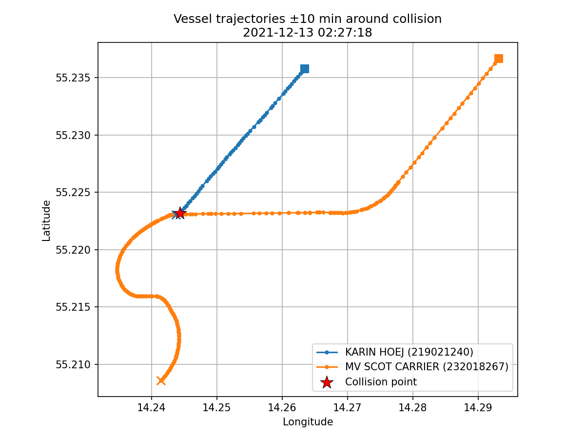

# AIS Vessel Collision Detection Task Report

This report describes the methodology used to detect a vessel collision in the
Danish AIS data for December 2021, within 50 nautical miles of the coordinate
(55.225, 14.245). Processing was done with PySpark.

## Data Cleaning

To exclude dirty data and potential GPS glitches, the following cleaning
strategy was applied:

Besides the given date restriction (December 2021), the location was first
restricted to roughly Baltic Sea coordinates (latitude 50–70, longitude 5–35)
as a pre-filter, and then to an exact 50 nautical mile radius around the
given centre coordinate using the Haversine distance. This removes pings resulting from GPS glitches or data recording errors. 

Rows with missing key fields (MMSI, timestamp, latitude, longitude, SOG) were
removed. MMSI with an incorrect format (not exactly 9 digits, or not starting
with 2–7) were removed to avoid base stations, other non-ships and faulty
data. Additionally, only Class A and Class B vessels were kept (excluding base
stations, navigation aids, etc.)

Moreover, based on a calculated implied speed (distance between two consecutive
positions of teh same ship), reports with an unrealistic speed (here
restricted to 45 knots; some ships can go faster, but it is unlikely) were
excluded to remove GPS jumps and other anomalies. This removes the individual
faulty ping, not the whole vessel track.

Similarly, to avoid capturing harbour activity, stationary vessels were removed
based on: 
* a navigational status of "At anchor", "Moored", "Aground", "Not under
command", "Restricted manoeuverability" or "Constrained by her draught"
* mean speed (SOG) below 1 kn
* an individual entry speed below 0.5 kn.

Initial attempts at capturing the collision returned many instances of fishing
vessels moving or getting closer together. Thus, additional filtering for status
"Engaged in fishing" was applied, the rationale being that fishing vessels are
much more likely to be in close proximity to each other (not indicating collision).
Similarly, initial attempts returned several instances of guard ships and rescuers which, after
investigation, appeared to be moving to the actual collision point as help.
Curiously, such ships had a smaller distance between them than the collision
event itself, placing them above the actual event in the ranking based on the (minimum) distance between ships. 
To not obscure the event,
vessels with names or ship types containing keywords indicating coast
guard / rescue (e.g. "SAR", "RESCUE", "KBV") were removed.

## Detection Strategy

To avoid a one-to-one comparison of every vessel (an O(n²) Cartesian product),
each vessel position was first assigned to a spatial grid cell and a time bucket:

* **Spatial grid:** the area was divided into fixed-size latitude/longitude
  cells. A cell size of 0.05° was chosen, which is about 3 km at this latitude. Such value was chosen as it is 
  larger than the 500 m collision threshold (so the neighbouring-cell
  check cannot miss a close pair), while still small enough to keep few vessels
  per cell.
* **Time bucket:** one-minute intervals.

Vessels observed within the same time bucket and grid cell were taken as
candidates for a close encounter. Neighbouring cells were also checked in case
the encounter happened on a cell edge, totalling up to 9 cells. This limits the
comparison to vessels already near each other in space and time, avoiding the
full pair-wise comparison.

The candidate pairs were then further filtered:

* The exact Haversine distance was calculated (for the candidates only),
  requiring the ships to be no more than 500 m apart.
* A minimum speed of 5 kn for both vessels, to further exclude slow harbour
  activity.
* A minimum course difference (≥ 20°), to avoid parallel vessels (low collision risk there).

Out of these candidate pairs, the one with the smallest distance was
chosen as the most likely collision event. The top 10 closest instances were
also collected for comparison and checks. 

## Results

The procedure identified the following as the most likely collision event:

| Field | Value |
|---------|---------|
| Vessel A MMSI | 219021240 |
| Vessel A Name | KARIN HOEJ |
| Vessel B MMSI | 232018267 |
| Vessel B Name | MV SCOT CARRIER |
| Timestamp (UTC) | 2021-12-13 02:27:18 |
| Latitude | 55.223184 |
| Longitude | 14.244365 |
| Minimum Distance | 16.9 m |

The results are also included in the output files. 

Further research showed that it was a real collision event, between a
Danish and a UK cargo ships on 13 December
2021. 

Thus, the programme successfully identified real collision. 

The trajectories of the two vessels in the 10 minutes before and after the
collision are shown below:

